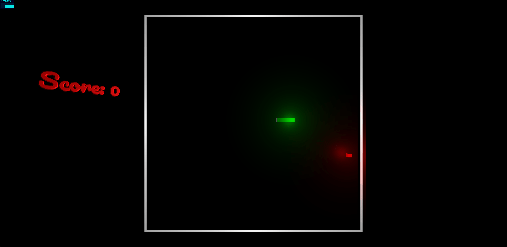

# 3D Snake Game with Three.js



## 🎮 Description
A modern implementation of the classic Snake game using Three.js, featuring 3D graphics, dynamic lighting, and interactive camera controls. This project demonstrates the use of 3D rendering, mesh manipulation, and real-time game physics in a web environment.

## 🛠️ Technologies Used
- Three.js for 3D rendering
- JavaScript for game logic
- HTML5 & CSS3 for structure and styling
- WebGL for hardware-accelerated graphics

## 🚀 Features
- 3D environment with dynamic lighting and shadows
- Interactive camera controls (rotate, pan, zoom)
- Smooth snake movement and collision detection
- Score tracking system
- Responsive design

## 🎯 How to Play
- Use arrow keys to control the snake's direction
- Collect food to grow the snake
- Avoid collisions with walls and the snake's body
- Use mouse controls to adjust the camera view:
  - Left click + drag to rotate
  - Right click + drag to pan
  - Scroll to zoom

## 💻 Local Development
1. Clone the repository:
   ```bash
   git clone https://github.com/Vikas-Kain/Snakegame.git
   ```
2. Navigate to the project directory
3. Start a local server (e.g., using Python):
   ```bash
   python -m http.server 8000
   ```
4. Open `http://localhost:8000` in your browser

## 📝 Project Highlights
- Implemented 3D graphics and physics using Three.js
- Created an interactive gaming environment with dynamic lighting
- Developed collision detection and game state management
- Built a responsive and user-friendly interface

## 🤝 Contributing
Contributions, issues, and feature requests are welcome! Feel free to check the [issues page](https://github.com/Vikas-Kain/Snakegame/issues).

## 📄 License
This project is open source and available under the [MIT License](LICENSE).